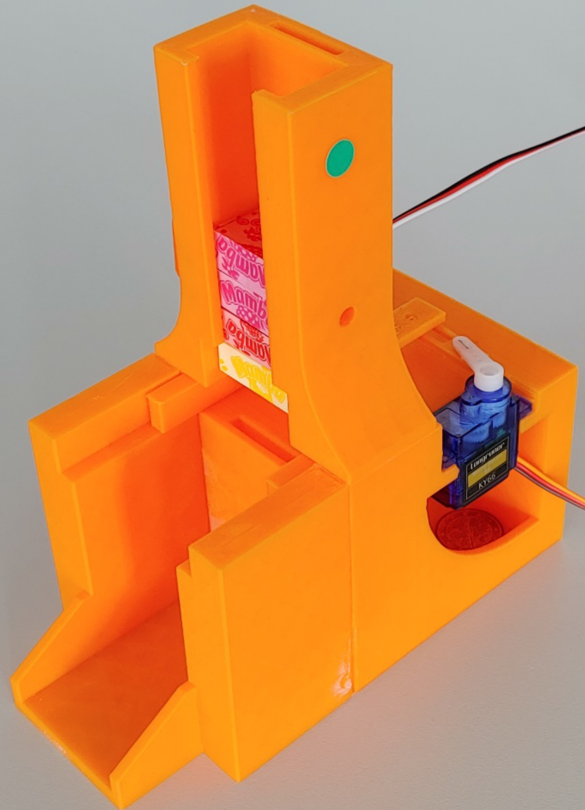

# Smart Candy Dispenser Bonbonautomat

  

This project was developed as part of my embedded systems class. The goal was to design and implement a small automated candy dispenser that reacts to user input, detects its internal fill level, and provides visual feedback using an RGB LED.

The system dispenses chewing gum candies using a servo-driven mechanism. A coin (or object simulating one) is inserted into a slider. When the user presses a button, the servo moves the slider forward, releasing one candy and directing the coin into a collection container.
If no coin is present, no candy is dispensed.

In addition, the system monitors the fill level of the candy container using a light-dependent resistor (LDR), allowing it to detect when the dispenser is running low.

## Features
- Controlled candy dispensing via servo motor
- Fill-level detection using an analog light sensor (ADC)
- Visual status indication using an RGB LED
- Smooth servo movement to protect mechanical components
- Limited dispensing when fill level is low
- Input handling via push button (active-low)

## Hardware Components
| Component           | Connection / Function                                      |
|--------------------|-----------------------------------------------------------|
| **Servo Motor**    | Timer 3, Channel 0 – controls the dispensing slider        |
| **RGB LED**        | Timer 3, Channels 1–3 – indicates system state             |
| **Push Button**    | GPIO Port C12 (active-low) – triggers dispensing           |
| **Fill-Level Sensor (LDR)** | ADC Channel 1 – detects candy fill level          |

## System Behavior
- The servo starts in a resting position.
- When the button is pressed, the servo:
    - Moves forward to the dispensing position
    - Releases one candy
    - Returns smoothly to the resting position
- The movement is done gradually (in ~100 steps with short delays) to avoid mechanical stress or jamming.

See demo here : https://github.com/ctd08/Smart-Candy-Dispenser-Bonbonautomat-/blob/d25d96dd94c21ee4848b8db373a290f086aa73cd/bonbon-demo.mp4

## Fill-Level Detection
The fill level is measured using an LDR connected via a voltage divider to the ADC.

**High ADC value → Candy present**

**Low ADC value → Container is empty**

Since ambient light affects readings, a threshold value is defined to distinguish between "full" and "empty".

## LED Status Indicators
| State                  | LED Color |
|------------------------|----------|
| Fill level sufficient  | 🟢 Green |
| Fill level low         | 🔴 Red   |
| Servo in motion        | 🔵 Blue  |

## Low Fill-Level Logic

When the system detects a low fill level:

- Only a limited number of dispensing actions are allowed
- After reaching this limit, no further output is possible
- The system remains locked until the sensor detects a sufficient fill level again

This prevents "empty" dispensing attempts and improves user feedback.

## Implementation Notes

- Servo control is implemented using PWM via Timer 3
- Minimum and maximum pulse widths are configurable constants to allow reuse with different servos
- Smooth motion is achieved through incremental position updates with delays
- ADC values are continuously monitored for real-time fill-level detection

## What I Learned

This project helped me gain hands-on experience with:

- PWM-based servo control
- ADC signal processing
- Embedded state handling and logic design
- Hardware-software interaction
- Designing systems with real-world constraints (mechanics, sensor noise, etc.)

  
